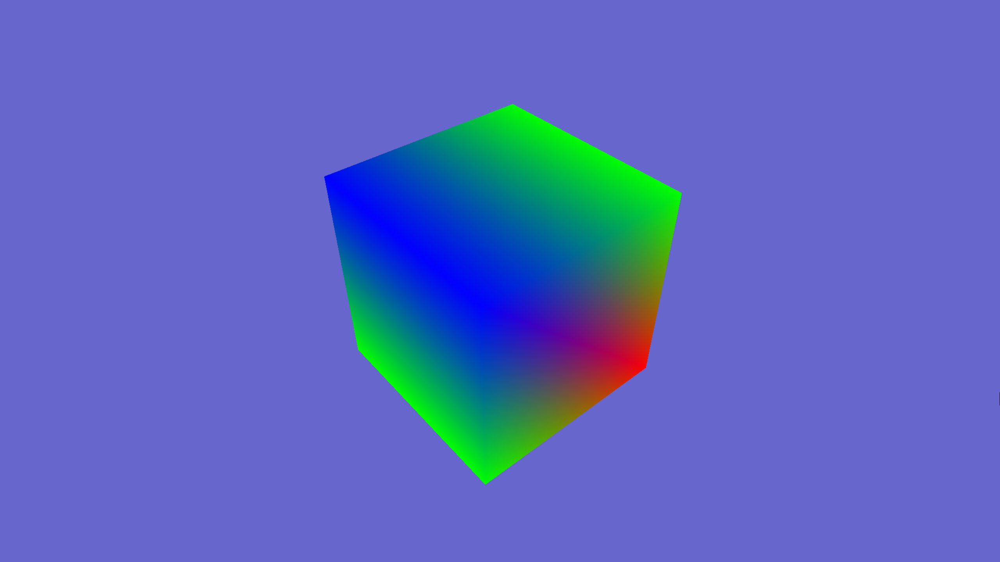

# Rayster: A DirectX 12 Rendering Engine for Rasterization and Raytracing

Disclaimer: This is my first major project in C++! Coming from a C and Rust background, my code likely won't be up to modern C++ standards, but I'm refactoring where I can as I work through learncpp.com. Loving the language so far!

Rayster is a toy rendering engine, targeting Windows 10 and using DirectX 12, with plans to support both rasterization and raytracing. The primary uses for the engine are to implement research papers I find interesting, learn more about mathematics and computing, and to scratch the artistic itch I get every now and then.

## Ocean Simulation
The Ocean Simulation project is the first rasterization project I plan to implement using Rayster. My goal is implement the FFT Ocean Simulation method described in Professor Tessendorf's paper, [Simulating Ocean Water](https://people.computing.clemson.edu/~jtessen/reports/papers_files/coursenotes2004.pdf). I'll work on the project and develop the engine concurrently, eventually creating a separate repo for the project when Rayster can stand on its own feet.

The checklist below serves to mark the progress I've made so far:
- [ ] Create Blinn-Phong Lighting with Skybox Reflections
- [ ] Ocean Plane Generation
- [ ] Tesselation?
- [ ] Naive IFT Compute Shader Implementation
- [ ] Use Philips Spectrum to create initial height map without phase shifting
- [ ] Fast IFT Compute Shader Implementation
- [ ] Implement Physically-Based Lighting
- [ ] Experiment with other Ocean Spectra
- [ ] Sea Foam?
- [ ] Underwater Crepuscular Rays?
- [ ] Sea Spray?

### Devlog
1/5/2026: I've spent most of winter break learning modern C++, so not much progress has been made on the engine itself. However, I've taken some time to do more research on Professor Tessendorf's paper and have created a general outline on the steps I want to take before I call the project finished. My plan for developing Rayster is intertwined with this project; I'll develop the subsystem(s) I need for the current checkmark, then actually implement the checkmark using the subsystems I made. By the time I finish, I should have most of the critical systems completed, allowing me to work on the raytracing side of the engine.
